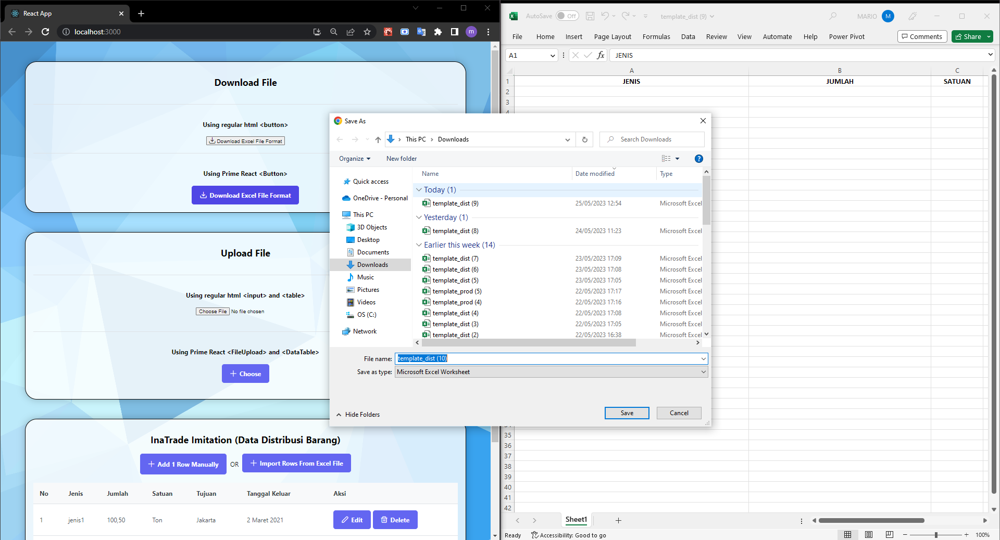
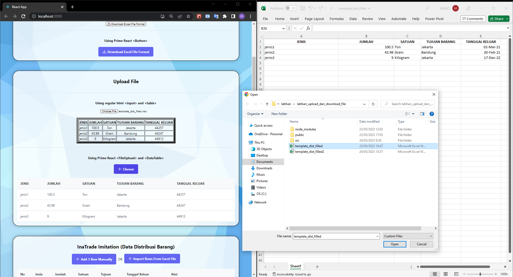
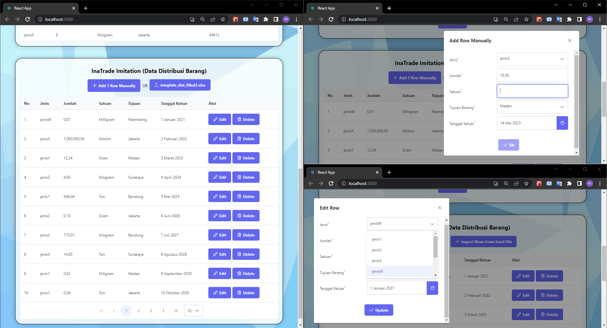

# Upload and Downloading Excel Files (+ CRUD on < DataTable > Component)

---

Testing with Upload and Downloading files (focusing on Excel Files). Also created my first fully-functioning CRUD table.

Project made by Mario (with some of my own code modifications).

---

Some screenshots:

---

The tutorial video can be found [here](https://www.youtube.com/watch?v=yd48ImBhC5U) and [here](https://www.youtube.com/watch?v=IPEqb_AJbAQ)

.
.
